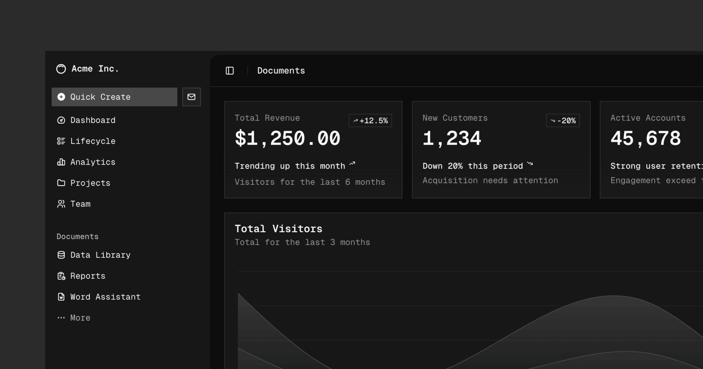

# shadcn-ng

[![npm version][npm-version-src]][npm-version-href]
[![npm downloads][npm-downloads-src]][npm-downloads-href]
[![bundle][bundle-src]][bundle-href]
[![License][license-src]][license-href]

A set of beautifully designed, accessible Angular components that you can copy and paste into your apps. Built on [@radix-ng/primitives](https://github.com/radix-ng/primitives). Free. Open Source. **Use this to build your own component library**.

## Documentation

Visit [ui.adrianub.dev](https://ui.adrianub.dev) to view the documentation.

## Contributing

Please read the [contributing guide](/CONTRIBUTING.md).

## License

Licensed under the [MIT license](./LICENSE.md).

<!-- Badges -->

[npm-version-src]: https://img.shields.io/npm/v/shadcn-ng?style=flat&colorA=080f12&colorB=1fa669
[npm-version-href]: https://npmjs.com/package/shadcn-ng
[npm-downloads-src]: https://img.shields.io/npm/dm/shadcn-ng?style=flat&colorA=080f12&colorB=1fa669
[npm-downloads-href]: https://npmjs.com/package/shadcn-ng
[bundle-src]: https://img.shields.io/bundlephobia/minzip/shadcn-ng?style=flat&colorA=080f12&colorB=1fa669&label=minzip
[bundle-href]: https://bundlephobia.com/result?p=shadcn-ng
[license-src]: https://img.shields.io/github/license/adrian-ub/shadcn-ng.svg?style=flat&colorA=080f12&colorB=1fa669
[license-href]: https://github.com/adrian-ub/shadcn-ng/blob/main/LICENSE
